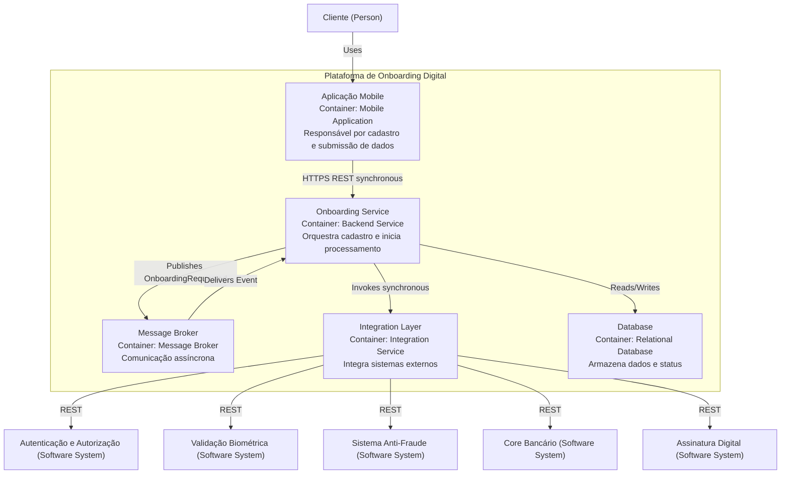

```mermaid
flowchart TB

%% Person
Client["Cliente (Person)"]

%% System Boundary
subgraph OnboardingPlatform["Plataforma de Onboarding Digital"]

MobileApp["Aplicação Mobile
Container: Mobile Application
Responsável por cadastro e submissão de dados"]

OnboardingService["Onboarding Service
Container: Backend Service
Orquestra cadastro e inicia processamento"]

MessageBroker["Message Broker
Container: Message Broker
Comunicação assíncrona"]

IntegrationLayer["Integration Layer
Container: Integration Service
Integra sistemas externos"]

Database["Database
Container: Relational Database
Armazena dados e status"]

end

%% External Systems
Auth["Autenticação e Autorização (Software System)"]
Biometric["Validação Biométrica (Software System)"]
Fraud["Sistema Anti-Fraude (Software System)"]
Core["Core Bancário (Software System)"]
Signature["Assinatura Digital (Software System)"]

%% Relationships
Client -->|Uses| MobileApp
MobileApp -->|HTTPS REST synchronous| OnboardingService
OnboardingService -->|Reads/Writes| Database
OnboardingService -->|Publishes OnboardingRequested| MessageBroker
MessageBroker -->|Delivers Event| OnboardingService
OnboardingService -->|Invokes synchronous| IntegrationLayer
IntegrationLayer -->|REST| Auth
IntegrationLayer -->|REST| Biometric
IntegrationLayer -->|REST| Fraud
IntegrationLayer -->|REST| Core
IntegrationLayer -->|REST| Signature
```
