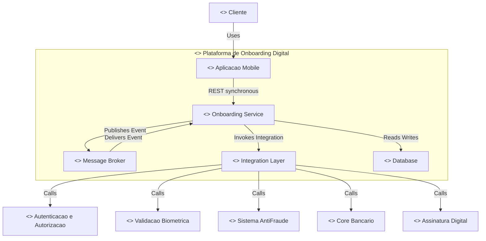

```mermaid
flowchart TB

%% Person
Client["<<Person>> Cliente"]

%% System Boundary
subgraph SystemBoundary["<<Software System>> Plataforma de Onboarding Digital"]

MobileApp["<<Container>> Aplicacao Mobile"]
OnboardingService["<<Container>> Onboarding Service"]
MessageBroker["<<Container>> Message Broker"]
IntegrationLayer["<<Container>> Integration Layer"]
Database["<<Container>> Database"]

end

%% External Systems
Auth["<<Software System>> Autenticacao e Autorizacao"]
Biometric["<<Software System>> Validacao Biometrica"]
Fraud["<<Software System>> Sistema AntiFraude"]
Core["<<Software System>> Core Bancario"]
Signature["<<Software System>> Assinatura Digital"]

%% Relationships
Client -->|Uses| MobileApp
MobileApp -->|REST synchronous| OnboardingService
OnboardingService -->|Reads Writes| Database
OnboardingService -->|Publishes Event| MessageBroker
MessageBroker -->|Delivers Event| OnboardingService
OnboardingService -->|Invokes Integration| IntegrationLayer
IntegrationLayer -->|Calls| Auth
IntegrationLayer -->|Calls| Biometric
IntegrationLayer -->|Calls| Fraud
IntegrationLayer -->|Calls| Core
IntegrationLayer -->|Calls| Signature
```
